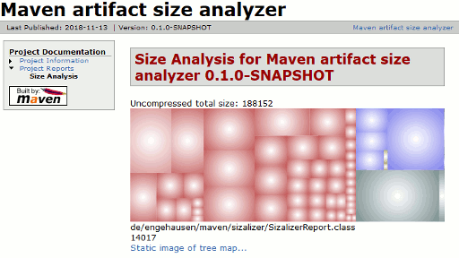
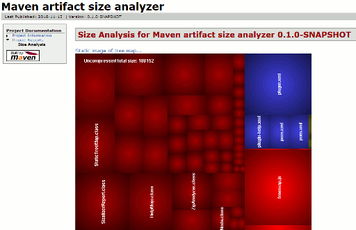

# Maven Size Analysis Report

The "sizalizer" Maven report plugin analyzes a Maven artifact and reports information about its size and contents using a tree map.

The analyzer shamelessly uses my [tree map project](https://github.com/smurf667/treemaplib).

## Usage

Add the plugin into the reporting section:

```xml
<reporting>
  <plugins>
    <plugin>
      <groupId>de.engehausen.maven</groupId>
      <artifactId>sizalizer-plugin</artifactId>
      <version>0.1.0-SNAPSHOT</version>
    </plugin>
  </plugins>
</reporting>
```

Currently supported packaging formats include .jar, .zip, .war and .ear. Analysis is pluggable, and further packaging formats can be added.

### Screenshots

By default, a JavaScript-based, navigatable tree map is displayed (left click to zoom in, right click to zoom out):



Additionally, a static PNG rendering of the tree map is be produced (this allows putting the size analysis report into PDF, for example):



### Configuration

The plugin supports the following configuration options (values represent defaults, except for color mapping):

```xml
<configuration>
  <staticImage>
    <!-- generates a PNG only if true -->
    <only>false</only>
    <width>640</width>
    <height>480</height>
    <!-- display nesting depth of tree map -->
    <depth>16</depth>
    <fontSize>12</fontSize>
  </staticImage> 
  <mappings>
    <mapping>
      <!-- regular expression for matching a file name in archive -->
      <match>\.class$</match>
      <!-- RGB color for matches -->
      <rgb>#ff00ff</rgb>
    </mapping>
    <mapping>
      <match>\.js$</match>
      <rgb>#ffff00</rgb>
    </mapping>
  </mappings>
</configuration>
```

## Building

To build and install, run

	mvn install

To verify everything is fine, run

	mvn de.engehausen.maven:sizalizer-plugin:help
